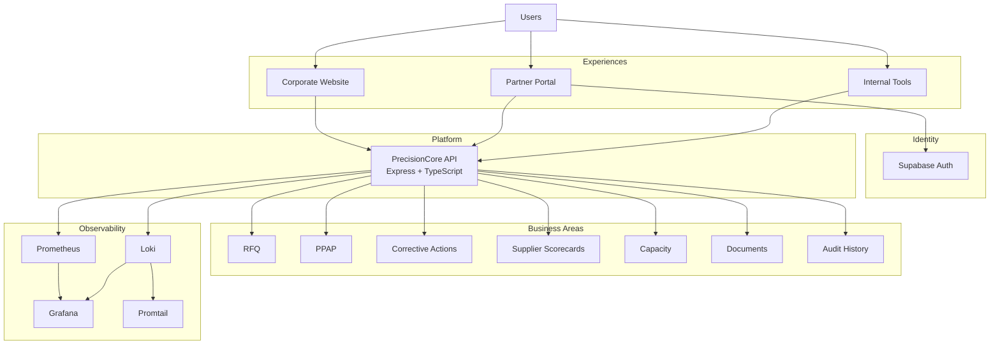

# PRECISIONCORE

### Digital Supplier Ecosystem · Adareth Labs · 2026

> **A fictional Tier 1 automotive supplier, built as though it were real.**


PrecisionCore is a speculative enterprise platform created by **Adareth Labs** for a prospective client.

The idea was simple: instead of designing a polished website, a supplier dashboard, and an API that merely happen to live in the same repository, we wanted to design the **whole machine**.

So PrecisionCore connects the public brand experience, supplier workflows, backend services, authentication, business rules, and observability into one system.

```text
                         PRECISIONCORE
                              │
          ┌───────────────────┼───────────────────┐
          │                   │                   │
          ▼                   ▼                   ▼
      WEBSITE            PARTNER PORTAL      INTERNAL TOOLS
          │                   │                   │
          └───────────────────┼───────────────────┘
                              │
                              ▼
                    PRECISIONCORE API
                              │
             ┌────────────────┼────────────────┐
             │                │                │
            RFQ              PPAP            QUALITY
             │                │                │
             └────────────────┼────────────────┘
                              │
                     AUTHENTICATION
                              │
                       OBSERVABILITY
```

**One business. One platform. Several very different jobs to do.**

---

# 01 / WHAT IS PRECISIONCORE?

PrecisionCore imagines the digital infrastructure behind a large automotive supplier working with manufacturers, suppliers, production teams, and quality programmes.

It covers both sides of the experience:

**What the world sees**

The corporate website, brand, products, capabilities, news, careers, and contact experience.

**What the business does**

Supplier management, RFQs, quotes, PPAP, quality, corrective actions, capacity, documents, permissions, and audit history.

The interesting part is what happens underneath:

**all of those things share the same platform.**

---

# 02 / THE CORPORATE WEBSITE

The website is the public side of PrecisionCore.

It answers the obvious questions quickly:

**Who are you?  
What do you make?  
Why should I care?  
How do I work with you?**

It includes:

- Products & solutions
- Manufacturing capabilities
- Innovation
- Company & leadership
- Sustainability
- Newsroom
- Careers
- Global presence
- Contact & enquiry flows

The website is designed to feel like the front door to a serious industrial organisation.

It is also part of the same product ecosystem as everything behind it.

---

# 03 / THE PARTNER PORTAL

The Partner Portal is where the relationship gets real.

This is where suppliers come to actually get work done.

They can:

- Review RFQs
- Submit quotes
- Manage PPAP submissions
- Respond to corrective actions
- View supplier scorecards
- Update capacity
- Access documents
- Review quality activity
- Manage their organisation
- See what needs their attention

The portal is deliberately built around **work**, not database screens.

Instead of:

```text
RFQ #1048
Status: 3
[Edit] [Delete]
```

the experience is closer to:

```text
RFQ #1048

AWAITING QUOTE

Due in 4 days

What you need to do
→ Submit quotation

What happens next
→ PrecisionCore reviews your submission
```

The system understands the process.

The interface makes that process understandable to the person using it.

---

# 04 / THE API

The API is the bit that keeps everything honest.

The website, Partner Portal, and internal tools all talk to the same backend.

```text
Website ───────┐
               │
Partner Portal ┼──→ PrecisionCore API ──→ Business Logic
               │                           │
Internal Tools ┘                           ├── RFQ
                                           ├── PPAP
                                           ├── Quality
                                           ├── Corrective Actions
                                           ├── Capacity
                                           ├── Documents
                                           └── Audit History
```

It handles authentication, permissions, business rules, workflows, and access to the underlying data.

Where a process has a real lifecycle, the API models that lifecycle explicitly.

For example:

```text
RFQ RECEIVED
     ↓
UNDER REVIEW
     ↓
QUOTE SUBMITTED
     ↓
AWARDED
     ↓
CLOSED
```

That is much more useful than letting everything become:

```text
status = "whatever"
```

---

# 05 / THE ARCHITECTURE



Nothing here is particularly exotic.

That is intentional.

The challenge is making all of the ordinary pieces behave like **one coherent system**.

---

# 06 / A SUPPLIER'S JOURNEY

A supplier relationship might look something like this:

```mermaid
flowchart LR
    START([Supplier])

    RFQ[RFQ Received]
    REVIEW[RFQ Review]
    QUOTE[Quote Submitted]
    AWARD[Business Awarded]

    PPAP[PPAP Submission]
    PPAP_REVIEW[PPAP Review]
    APPROVED[PPAP Approved]

    PRODUCTION[Production]
    QUALITY[Quality Monitoring]
    CAR[Corrective Action]
    CLOSED[Issue Closed]

    START --> RFQ
    RFQ --> REVIEW
    REVIEW --> QUOTE
    QUOTE --> AWARD

    AWARD --> PPAP
    PPAP --> PPAP_REVIEW
    PPAP_REVIEW --> APPROVED

    APPROVED --> PRODUCTION
    PRODUCTION --> QUALITY
    QUALITY --> CAR
    CAR --> CLOSED
    CLOSED --> QUALITY
```



In human terms:

**Get the opportunity → win the business → get qualified → produce the thing → keep it working properly.**

That's the business.

The software exists to make that journey easier to manage.

---

# 07 / SIGN-IN & ACCESS

PrecisionCore uses **Supabase Auth** for authentication.

A simplified request looks like this:

```text
Supplier
   ↓
Partner Portal
   ↓
Supabase Auth
   ↓
Authenticated session
   ↓
PrecisionCore API
   ↓
Check permissions
   ↓
Return the right data
```

Two different questions are being answered:

**Authentication**

> Who are you?

**Authorization**

> What are you allowed to do?

For the case study, suppliers are grouped into three illustrative access levels:

| Level | Meaning |
|---|---|
| `BASIC` | Standard supplier access |
| `QUALIFIED` | Additional operational access |
| `STRATEGIC` | Highest level of collaboration |

Simple enough to understand. Structured enough to demonstrate the pattern.

---

# 08 / OBSERVABILITY

Eventually, something will go wrong.

The system should know before somebody opens a ticket titled:

> “Hi, everything appears to be broken.”

PrecisionCore includes an observability layer using:

**Prometheus · Grafana · Loki · Promtail**

```text
                 PRECISIONCORE API
                       │
              ┌────────┴────────┐
              │                 │
           METRICS             LOGS
              │                 │
              ▼                 ▼
         Prometheus            Loki
              │                 │
              └────────┬────────┘
                       ▼
                    Grafana
```

This provides visibility into:

- Application metrics
- Logs
- Errors
- Health
- Operational activity
- System behaviour

Because “it works on my machine” is not quite an observability strategy.

---

# 09 / WHAT WE'RE DEMONSTRATING

PrecisionCore is designed to show that product design and engineering don't have to live in separate boxes.

### Product & UX

Turning a complicated enterprise domain into interfaces people can actually use.

### Design Systems

Creating a common language across public and authenticated experiences.

### Frontend Engineering

Building polished interfaces for different audiences with very different needs.

### Backend Engineering

Putting business logic in the right place and giving the platform a clear domain model.

### Workflow Design

Turning business processes into explicit states, actions, permissions, and transitions.

### Authentication & Authorization

Separating identity from what a user is actually allowed to do.

### Observability

Treating monitoring and operational visibility as part of the product.

### Systems Thinking

Making all of those things work together.

---

# 10 / DESIGN PRINCIPLES

## Make complexity do its job

Enterprise systems are complicated.

The answer isn't pretending they aren't.

The answer is keeping the complexity where it belongs: in the system, not in the user's head.

## Build around work

People rarely wake up wanting to “update a database record.”

They want to submit a quote, approve something, fix an issue, check a status, or get an answer.

The product should reflect that.

## Make the next step obvious

Good enterprise software should answer:

**What am I looking at?  
What matters?  
What needs my attention?  
What happens next?**

## Keep the system connected

The website shouldn't feel like it was built by one team, the portal by another, and the API by a third team who have never met.

Everything should feel like it belongs to PrecisionCore.

## Design for the day after launch

A product is not finished when the screens look good.

It also needs authentication, permissions, logging, monitoring, useful failure states, and enough structure to understand what is happening when things inevitably go sideways.

---

# 11 / REPOSITORY

```text
precisioncore/
│
├── website/
│   └── Public corporate experience
│
├── partner-portal/
│   └── Authenticated supplier experience
│
├── api/
│   └── Express + TypeScript backend
│
├── monitoring/
│   └── Observability configuration
│
├── design-system/
│   └── Shared design-system documentation and assets
│
├── components/
│   └── Shared component references
│
├── data/
│   └── Illustrative, non-sensitive data
│
├── documentation/
│   └── Architecture and case-study material
│
└── README.md
```

---

# 12 / ENGINEERING NOTES

The project is intended to demonstrate how the pieces of an enterprise product fit together.

The important questions are:

```text
What does the business actually do?
          ↓
What are the important entities?
          ↓
What workflows connect them?
          ↓
Who can see or change them?
          ↓
Where should the business rules live?
          ↓
How do we know the system is healthy?
```

The technology is there to support those answers.

Not the other way around.

---

# 13 / SECURITY

This repository is a demonstration project.

Never commit:

```text
.env files containing secrets
API keys
Access tokens
Service credentials
Private certificates
Database credentials
Production configuration
Other sensitive information
```

Use ignored local environment files or an appropriate secret-management solution for development and deployment credentials.

---

# 14 / CASE STUDY

PrecisionCore was created by **Adareth Labs** as a speculative case study for a prospective client.

It demonstrates how we approach complex digital products across:

**strategy → product design → UX → engineering → architecture → operations**

The point isn't to pretend the fictional company exists.

The point is to show what we would build, how we would think about it, and how the pieces would fit together.

---

# 15 / DISCLAIMER

**PrecisionCore is entirely fictional.**

Companies, suppliers, facilities, products, metrics, financial information, news stories, records, operational information, and other business details are illustrative.

This repository is not a production system, real company, or representation of an existing client implementation.

---

# 16 / STATUS

**Speculative Case Study · 2026**

PrecisionCore is an evolving project.

Some areas are implemented as working software.

Others exist to demonstrate intended product behaviour, architecture, workflows, or operational concepts.

That distinction is intentional.

---

---

<div align="center">


### ADARETH LABS

**Digital product design · Engineering · Systems architecture**

> **Build the system, not just the screen.**

</div>
